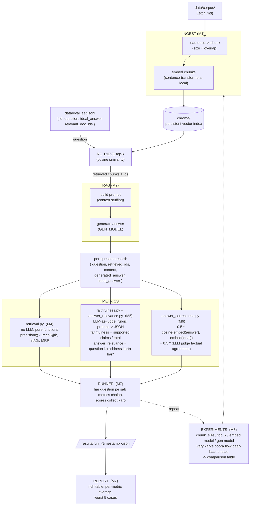
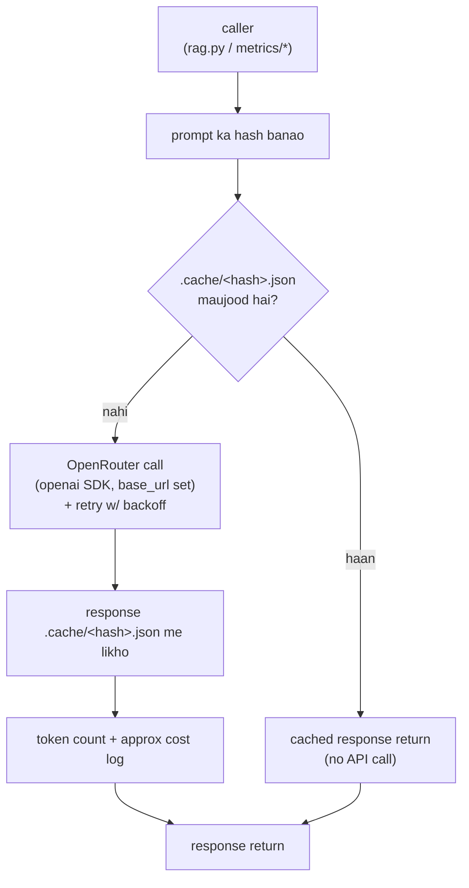

# RAGScore — Architecture

## 1. Ek line me
Ek RAG evaluation harness: document corpus + ground-truth questions do, aur ye
kisi RAG pipeline ke answers ko 6 metrics pe score karke JSON report + terminal
table deta hai. Sab scratch se — koi LangChain / LlamaIndex nahi.

## 2. Data flow (end-to-end)



### LLM call path (har generate + judge call isi se jaata hai)



## 3. Components (har module ka role)

| Module | Responsibility | Side-effects | Milestone |
|---|---|---|---|
| `ragscore/config.py` | `@dataclass` config; `.env` + `argparse` se load (models, chunk_size, top_k, paths) | env read | M0 |
| `ragscore/llm.py` | OpenRouter wrapper: disk cache (prompt hash → JSON), retry+backoff, token/cost log | network, disk | M0 |
| `ragscore/ingest.py` | corpus load → chunk (fixed size + overlap) → embed → Chroma me store | disk, model load | M1 |
| `ragscore/rag.py` | query → top-k retrieve (Chroma) → prompt build → `GEN_MODEL` se answer | network | M2 |
| `ragscore/dataset.py` | `eval_set.jsonl` ka schema + loader (`{id, question, ideal_answer, relevant_doc_ids}`) | disk read | M3 |
| `ragscore/metrics/retrieval.py` | `precision@k`, `recall@k`, `hit@k`, `MRR` — pure functions, no LLM | none | M4 |
| `ragscore/metrics/faithfulness.py` | LLM judge: answer ko atomic claims me todo, context ke against check → 0..1 | network (via llm.py) | M5 |
| `ragscore/metrics/answer_relevance.py` | LLM judge: answer question ko kitna address karta hai → `{score, reason}` | network | M5 |
| `ragscore/metrics/answer_correctness.py` | `0.5*cosine(embed(answer), embed(ideal))` + `0.5*(LLM judge factual agreement)` | network, model | M6 |
| `ragscore/runner.py` | sab questions pe sab metrics chalao → `results/run_<ts>.json` | disk | M7 |
| `ragscore/report.py` | run JSON → rich table (per-metric average, worst 5 cases) | stdout | M7 |
| `ragscore/experiments.py` | params (chunk_size, top_k, models) vary karke runner ko baar-baar chalao → compare table | disk | M8 |

**Rule:** pure logic (metrics, chunking, scoring math) aur side-effects (API, file IO,
model load) alag rakhe jaate hain — isse unit test me LLM mock karna aasaan hai.

## 4. Key design decisions

- **Koi framework nahi (LangChain/LlamaIndex ban).** Retrieval, prompt build, judge
  loop sab visible code — yahi seekhne ka point hai.
- **Local embeddings** (`sentence-transformers`, `bge-small-en-v1.5`) — koi API cost
  nahi, offline chalti hain, deterministic.
- **LLM sirf 2 jagah:** answer generation (`GEN_MODEL`, sasta) aur judge
  (`JUDGE_MODEL`, strong). Dono OpenRouter ke through ek hi `llm.py` wrapper se.
- **Disk cache mandatory.** Prompt ka hash → response JSON `.cache/` me. Re-run
  lagbhag free, aur experiments repeatable.
- **Retrieval metrics me LLM nahi.** Pure IR math, hand-computed unit tests ke saath.
- **Config ek dataclass.** Env se defaults, `argparse` se override — har module
  standalone runnable (`python -m ragscore.ingest --help`).
- **Judge bias ka dhyaan** (position, verbosity, self-preference) — rubric prompt +
  JSON output se controlled, M5 concept notes me documented.

## 5. File & folder structure

```
RAGScore/
├── ragscore/                     # main package
│   ├── __init__.py
│   ├── config.py                 # dataclass config, env + CLI args           [M0]
│   ├── llm.py                    # OpenRouter wrapper + disk cache + retry     [M0]
│   ├── ingest.py                 # docs → chunks → embeddings → chroma         [M1]
│   ├── rag.py                    # retrieve + generate (basic RAG pipeline)    [M2]
│   ├── dataset.py                # eval set schema + loader                    [M3]
│   ├── metrics/
│   │   ├── __init__.py
│   │   ├── retrieval.py          # precision@k, recall@k, MRR, hit@k           [M4]
│   │   ├── faithfulness.py       # LLM-as-judge: claims vs context            [M5]
│   │   ├── answer_relevance.py   # LLM-as-judge: answer vs question           [M5]
│   │   └── answer_correctness.py # cosine + LLM factual agreement             [M6]
│   ├── runner.py                 # sab questions pe eval → results JSON        [M7]
│   ├── report.py                 # rich table + summary + failure cases       [M7]
│   └── experiments.py            # chunk_size / top_k / model ablation        [M8]
│
├── data/
│   ├── corpus/                   # source docs (5-10 chhoti .txt/.md files)   [M1]  (gitignored)
│   └── eval_set.jsonl            # hand-made questions + ground truth (~20)    [M3]
│
├── tests/
│   ├── test_retrieval_metrics.py # fake ranked lists, hand-computed expected  [M4]
│   ├── test_llm_cache.py         # same prompt 2x → 2nd baar cache hit         [M0/M4]
│   └── test_*.py                 # baaki metrics, LLM calls mocked
│
├── results/                      # run output JSON                            [M7]  (gitignored)
├── .cache/                       # LLM response cache (prompt hash → JSON)     [M0]  (gitignored)
├── chroma/                       # persistent vector index                    [M1]  (gitignored)
│
├── architecture.md              # ye file
├── CLAUDE.md                    # full build plan + working style + conventions
├── README.md                   # setup + usage + experiment writeups (M9)
├── requirements.txt            # 7 direct deps (transitive deps pip khud laata hai)
├── .env.example                # env template → copy to .env
├── .env                        # secrets (gitignored)
└── venv/                       # virtualenv (gitignored)
```

## 6. Artifacts & git

| Path | Git me? | Kyun |
|---|---|---|
| `ragscore/`, `tests/`, `*.md`, `requirements.txt`, `.env.example`, `data/eval_set.jsonl` | ✅ commit | source + hand-made eval data |
| `.env` | ❌ | secrets (API key) |
| `.cache/` | ❌ | LLM response cache, machine-local |
| `chroma/` | ❌ | regenerable vector index |
| `results/` | ❌ | run outputs; summary README me jaata hai |
| `data/corpus/` | ❌ | bade/borrowed text; README me source link |
| `venv/` | ❌ | environment |

## 7. Milestone map

| M | Deliverable | Core concept |
|---|---|---|
| **M0** | `config.py`, `llm.py`, OpenRouter smoke test, cache verify | env config, API wrapper, caching |
| **M1** | `ingest.py` + corpus → chunks → embeddings → Chroma | chunking strategies, embeddings, vector similarity |
| **M2** | `rag.py` — query → top-k → prompt → generate | top-k retrieval, context stuffing, prompt design |
| **M3** | `eval_set.jsonl` (~20 Q) + `dataset.py` loader | gold datasets, ground truth, question types |
| **M4** | `metrics/retrieval.py` + unit tests | IR metrics, `@k` ka matlab |
| **M5** | `faithfulness.py`, `answer_relevance.py` (LLM judge) | LLM-as-judge, pointwise vs pairwise, judge bias |
| **M6** | `answer_correctness.py` (cosine + judge) | reference-based eval, embedding similarity limits |
| **M7** | `runner.py` + `report.py` | aggregation, CI-style eval |
| **M8** | `experiments.py` — param ablation + comparison table | ablation, regression tracking |
| **M9** | README polish: setup + 3 experiment results + "kya seekha" | — |
